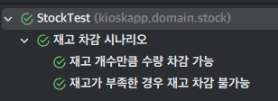
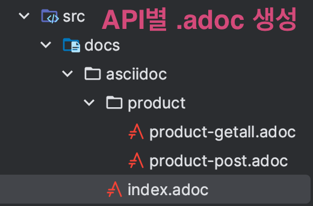
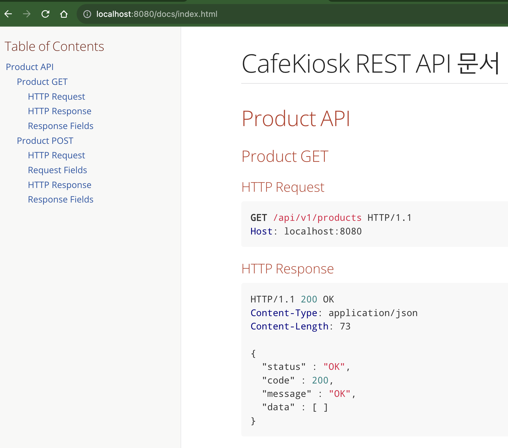

# Test Tips
### 1. 경계값을 테스트하라.
ex) 이상, 초과, 이하, 미만 등.

### 2. 테스트 하기 어려운 영역을 구분하라.
Test 하기 어려운 영역은 크게 2가지다.
1. 난수, 현재 시간, 사용자 입력 등 - Input 의존
2. DB 상태, 이메일 API 등 - Output 의존

> 테스트 용이하기 위한 코드로 변경하기 위해 
> 해당 영역을 **외부로 분리**해야한다.

### 3. RED - GREEN - Refactor


### Why first test?
- 엣지 케이스를 놓치지 않을 수 있게 된다. \
선 구현 방식은 테스트 케이스를 작성할 때 이미 편협한 상태가 된다. (인간의 사고상)
- 빠른 피드백으로 코드 변경이 용이해진다.
- 애초에 이해하기 쉽고 간단한 테스트 케이스를 작성하게된다. \
=> Maintainable code
- 테스트를 먼저 썼기 때문에 , 구현부에서도 테스트 가능한 코드를 쓰게된다. (관점의 변화)
```java
@Getter
public class CafeKiosk {
    private static final LocalTime SHOP_OPEN_TIME = LocalTime.of(7, 0);
    private static final LocalTime SHOP_CLOSE_TIME = LocalTime.of(18, 0);

    /*
    * 테스트 어려운 코드
    * 랜덤값, 현재 시간 값 등 Input 의 예측 불가능성
    */
    public Order createOrder() {
        LocalDateTime currentDateTime = LocalDateTime.now();
        LocalTime currentTime = currentDateTime.toLocalTime();
        if (currentTime.isBefore(SHOP_OPEN_TIME) || currentTime.isAfter(SHOP_CLOSE_TIME)) {
            throw new IllegalArgumentException("You cannot place an order between 07:00 and 18:00");
        }
        return new Order(LocalDateTime.now(), beverages);
    }

    /*
    * 테스트 용이한 코드
    * Input 의 의존성을 외부로 분리하여 예측 가능성.
    */
    public Order createOrder(LocalDateTime currentDateTime) {
        LocalTime currentTime = currentDateTime.toLocalTime();
        if (currentTime.isBefore(SHOP_OPEN_TIME) || currentTime.isAfter(SHOP_CLOSE_TIME)) {
            throw new IllegalArgumentException("You cannot place an order between 07:00 and 18:00");
        }
        return new Order(LocalDateTime.now(), beverages);
    }
}
```

### 4. DisplayName 은 동사로 써라.
명사 나열 보다는 동사형 문장이 더 쉽게 이해된다. \
테스트는 곧 문서가 된다.
#### AS-IS
```java
// 명사형
@Test
@DisplayName("success - 아메리카노 2잔 추가 테스트")
void addSeveralBeverages() {
    var cafeKiosk = new CafeKiosk();
    cafeKiosk.add(new Americano(), 2);
    assertThat(cafeKiosk.getBeverages()).hasSize(2);
}
```
#### TO-BE
```java
@Test
@DisplayName("success - 아메리카노 2잔 추가시 2잔이 주문 목록에 담긴다.")
void addSeveralBeverages() {
    var cafeKiosk = new CafeKiosk();
    cafeKiosk.add(new Americano(), 2);
    assertThat(cafeKiosk.getBeverages()).hasSize(2);
}
```
> 메소드 관점보다 **도메인 용어**를 써라
> 
#### AS-IS
특정 시간 이전 주문 실패
#### TO-BE
카페 영업 시간 이전 주문 불가

실패와 성공 같은 **테스트 현상**을 설명할 필요가 없다.
**도메인 관점에서 작성하라.**


### 5. 한 문단에 한 주제
테스트에 if, for 같은 조건식, 반복문 등의 논리구조를 쓰는 테스트는 지양하라. \
논리구조 존재 자체가 여러 주제를 담으려는 노력의 방증이다. \
하나의 테스트는 하나의 문서다. 반드시 하나의 주제를 담도록 given - when - then 을 간단하게 구성하라.

### 6. 테스트내 독립성 보장.
#### (1) given 절에는 로직을 넣지 마라
given 절에 비즈니스 로직이 있으면 코드를 읽는 사람의 인지 부하가 생길 수 있다.
또, 테스트 의도와 다르게 흘러갈 가능성도 높아진다.

#### (2) 팩토리 메소드 사용을 지양하라.
> 숨은 로직을 실행시키는 팩토리 메소드 대신, 일반 생성자나 빌더 메소드를 사용하는 것이 좋다.

팩토리 메소드는 개발자가 어떤 의도를 갖고 Validation 이나 조건을 넣었을 가능성이 있고 \
이는 테스트 환경의 독립성을 헤친다.


### 7. 테스트간 독립성 보장.
> **given 절에 올 리소스를 공통의 리소스로 빼지마라.**

공유 리소스의 상태를 변경시 테스트내 의존성을 갖게된다.

###  8. Test Fixture 사용
#### (1) `@BeforeEach` 에 given 절에 올 데이터를 넣지마라.
테스트는 문서다. \
하나의 테스트 안에서 given - when - then 을 확인할 수 있어야한다. \
BeforeEach 에 두면 테스트 클래스가 커질 수록 `given` 절 조건을 확인하기 위해 위로 스크롤을 올려야할 것이다.

전역 변수와 마찬가지로 `@BeforeEach` 에 리소스를 명시하면 해당 테스트 클래스에 대해 의존성이 생긴다.
즉, `@BeforeEach`절 수정이 모든 테스트에 영향을 미치게된다.

#### 그럼 `@BeforeEach` 에는 뭐가 와야하나?
1. 각각 테스트 입장에서 몰라도 되는 데이터가 오는 경우.
2. @BeforeEach 수정이 각각 테스트에 영향을 미치지 않는 경우. 

#### (2) `data.sql` 등을 테스트에 넣지마라.
복잡도가 증가하고 관리포인트가 된다. \
프로젝트 규모가 커질 수록 sql 문이 가파르게 증가하고 데이터 변화에 따라 sql 문 변경도 잦아져 관리 소요가 늘어난다. \
또, `given` 절에 올 데이터를 일일히 sql 문을 확인해야 한다.

### 9. Use `deleteAllInBatch`, Don't `deleteAll`
테스트 케이스마다 테이블 cleans 시 외래키 참조 제약조건 때문에 막힐 수 있다.
deleteAll 은 이런 문제를 해결하지만, 연산 비용이 매우 비싸다.
따라서 테이블 관계를 고려하여 삭제 순서를 결정하고, deleteAllInBatch 를 쓰는게 더 낫다.

#### deleteAllI
1. SELECT * FROM table
2. Delete each row from the table with `WHERE` condition
=> **Queries are to be executed the number of rows.**
=> Cost is expensive

> 대신, Delete 할 때 부모-자식간 외래키 참조 관계도 함께 지워준다.

#### deleteAllInBatch
1. TRUNCATE the table at once

> This doesn't consider referential constraint.

### 10. 공유 리소스로 단계별 테스트를 한다면 DynamicTest 를 활용하라.

일반적인 테스트에서 given when then 을 작성하면 \
어느 부분에서 시나리오를 끊어서 해석해야할지 알기 어렵다. \
DynamicTest 는 단계별 시나리오를 나눠 공통의 리소스에 대해 테스트하기 용이하고 가독성도 높인다.

#### StockTest.java

```java
class StockTest{
    @DisplayName("재고 차감 시나리오")
    @TestFactory
    Collection<DynamicTest> deductQuantityNotEnoughStock() {
        // Shared resource
        Stock stock = new Stock(1);

        return List.of(
            dynamicTest("재고 개수만큼 수량 차감 가능", ()->{
                // given
                int quantity = 1;

                // when
                stock.deductQuantity(quantity);

                //then
                assertThat(stock.getQuantity()).isZero();
            }),

            dynamicTest("재고가 부족한 경우 재고 차감 불가능", ()->{
                // given
                int quantity = 1;
                
                // when // then
                assertThatThrownBy(()->stock.deductQuantity(quantity))
                    .isInstanceOf(IllegalArgumentException.class)
                    .hasMessage("재고가 부족합니다.");
            })
        );
    }
}
```

#### Result
공통의 시나리오를 `@DisplayName`로 묶고 하위 단계에 이름을 붙여 가독성을 높인다.


### 11. Private Method 테스트는 해야하는가?
**할 필요가 없다.** \
외부 클라이언트는 public 만 검증하면 자동으로 private 도 검증된다. \
외부에 공개된 것만 테스트하라.

Q. private method 가 너무 무거워서 테스트가 필요하다는 생각이 든다면?
A. 별도의 클래스를 만들어야 할 때가 아닌지 자문해봐야한다.

### 12. 프로덕션에는 안쓰이지만 테스트에만 쓰이는 메소드는 만들어도 되는가?
**만들어도 된다.** \
예를 들면 @NoArgsConstructor, @Getter, @Builder 와 같은 것들로 범용성있고 다른 테스트에도 유용하게 쓰일 메소드들이다. \
그래도 무분별한 사용은 지양하라.

---

## Spring REST Docs 활용
테스트 코드를 통한 API 문서 자동화 도구로 Swagger 와 자주 비교된다.

### RESTDocs vs Swagger
|Index|REST Docs| Swagger                                            |
|------|------------|----------------------------------------------------|
|Pros|- 높은 신뢰도 <br>테스트를 통과해야만 문서가 만들어진다. <br>- 프로덕션 코드에 영향을 미치지 않음| - 적용이 쉬움 <br>- 문서에서 바로 API 호출이 가능함                 |
|Cons|- 설정이 어려운편 <br>- 문서를 위해 반드시 테스트를 작성해야 한다는 제약 <br>- 많은 코드량| - 프로덕션 코드에 침투적 <br>- 상대적으로 낮은 신뢰도 <br>(테스트코드 제약 X) |


### 설정 방법
#### (1) build.gradle 의존성 추가

#### (2) RestDocsSupport class 작성
MockMVC, 직렬화를 위한 ObjectMapper 는 거의 필수
```java
@ExtendWith(RestDocumentationExtension.class)
public abstract class RestDocsSupport {

  protected MockMvc mockMvc;

  protected ObjectMapper objectMapper = new ObjectMapper();

  @BeforeEach
  void setUp(RestDocumentationContextProvider provider) {
    this.mockMvc = MockMvcBuilders.standaloneSetup(initController())
        .apply(MockMvcRestDocumentation.documentationConfiguration(provider))
        .build();
  }

  protected abstract Object initController();
}
```

#### (3) Controller Test 코드 작성
```java
public class ProductControllerDocsTest extends RestDocsSupport {
  private final ProductService productService = mock(ProductService.class);

  @Override
  protected Object initController() {
    return new ProductController(productService);
  }

  @Test
  @DisplayName("판매 상품 전체를 조회한다.")
  public void getAllProducts() throws Exception {
    // given

    // when // then
    mockMvc.perform(
            MockMvcRequestBuilders.get("/api/v1/products")
        )
        .andDo(print())
        .andExpect(status().isOk())
        .andExpect(jsonPath("$.code").value(200))
        .andExpect(jsonPath("$.status").value("OK"))
        .andExpect(jsonPath("$.message").value("OK"))
        .andExpect(jsonPath("$.data").isArray())
        .andDo(document("product-readAll",
            preprocessResponse(prettyPrint()),
            responseFields(
                fieldWithPath("code").type(JsonFieldType.NUMBER)
                    .description("HTTP 응답 코드"),
                fieldWithPath("status").type(JsonFieldType.STRING)
                    .description("응답 코드"),
                fieldWithPath("message").type(JsonFieldType.STRING)
                    .description("응답 메시지"),
                fieldWithPath("data").type(JsonFieldType.ARRAY)
                    .description("응답 데이터")
            )
        ));
  }
}
```

#### (4) snippet 템플릿 작성

`test/resources/org.springframework.restdos.templates` 참조
```snippet
==== Request Fields
|===
|Path|Type|Required|Description

{{#fields}}

|{{#tableCellContent}}`+{{path}}+`{{/tableCellContent}}
|{{#tableCellContent}}`+{{type}}+`{{/tableCellContent}}
|{{#tableCellContent}}{{^optional}}✅{{/optional}}{{/tableCellContent}}
|{{#tableCellContent}}{{description}}{{/tableCellContent}}

{{/fields}}

|===
```

#### (5) build
Gradle > Tasks > build
Gradle > Tasks > documentation > asciidoctor

실행시 build/${outDir} 에 `.adoc` 파일들이 생성된다.

#### (6) src/docs 디렉토리에 .adoc 파일 작성


index.adoc 파일과 디렉토리
```adoc
ifndef::snippets[]
:snippets: ../../build/generated-snippets
endif::[]
= CafeKiosk REST API 문서
:doctype: book
:icons: font
:source-highlighter: highlightjs
:toc: left
:toclevels: 3
:sectlinks:

[[Product-API]]
== Product API

include::product/product-getall.adoc[]

include::product/product-post.adoc[]
```

#### (7) jar 파일 실행 및 접속
```bash
$ java --jar build/libs/${Project-Name}.jar
# ${IP}:${PORT}/docs/index.html 접속
```

### 결과 예시


### 언제 RESTDocs 를 쓸까?
- FrontEnd 개발자들에게 빠르게 API 명세서를 줘야할 때
- Mock 을 빠르게 구성하는것이 가능할 때 (Test 코드 필수)
- Docs 에서 코드 실행이 필요하지 않을 때

솔직히 내 입장에서는 UI, mock 데이터 및 test 코드 강제부터 별로 맘에 들지 않는다.
이럴 바엔 Swagger 쓰는게 낫지 않나 싶다.
하던 찰나에 둘을 조합해서 쓰는 방법을 소개한 [블로그](https://jwkim96.tistory.com/274)를 찾았다.

### REST Docs + Swagger 조합 사용
REST Docs 결과물로 OAI 3.0 스팩을 출력하고 OAI 3.0 기반으로 .html 페이지 생성
=> REST Docs 의 높은 신뢰성 + Swagger 의 웹 테스트와 멋진 UI 동시 사용

여전히 REST Docs 설정이 귀찮긴 하지만 초기에 한번만 고생하면 되니까 이정도는 괜찮다.

- [참조 블로그](https://jwkim96.tistory.com/274) 

---
## BDD
Behavior Driven Development
- 함수 단위 테스트보다 시나리오 기반 TC에 집중.
- 개발자가 아닌 사람이 봐도 이해할 수 있을 정도의 추상화 필요.

#### How to?
- Given - When - Then == Arrange - Act - Assert

## CQRS
**커맨드용 서비스(Create Update Delete)와 쿼리(Read) 서비스를 분리하는 설계**

#### When to use?
Single Point of Failure 문제 해결

#### Why to use?
> 장애 격리

CQRS 없이 통합서비스 사용시 커맨드 장애가 쿼리 장애로 이어지고 읽기 장애도 마찬가지로 커맨드 서비스 장애로 이어진다.
대부분의 DB는 Write Only (Master) 와 Read Only (Slave)로 Endpoint 를 나눠서 접근할 수 있는데
CQRS 는 DB와 서비스를 분리시킬 수 있는 장점이 있다.

#### How to use
DB Endpoint 를 분리하여 서비스에 할당한다.

(1) 통합 서비스 사용시 `@Transactional(readOnly = true)` 클래스에 설정
Spring + Layered Architecture 프로젝트에선 Service 최상단에 @Transactional(readOnly = true) 를 설정해놓고
Command 가 필요한 메소드에만 `@Transactional` 어노테이션을 붙이는 방식을 채택한다.

```java
@Service
@Transactional(readOnly = true)
public class ProductService {
  // Query
  public List<ProductResponse> getSellingProducts() {}

  // Command
  @Transactional
  public ProductResponse createProduct(ProductCreateRequest request) {}
}
```
(2) 커맨드 서비스 / 쿼리형 서비스 분리
커맨드 서비스에는 `@Transactional`, 쿼리형(읽기) 서비스에는 `@Transactional(readOnly = true)` 를 붙인다. 

```java
@Service
public class ProductCommandService {
  // Command
  public ProductResponse createProduct(ProductCreateRequest request) {}
}
```

```java
@Service
public class ProductQueryService {
  // Query
  public List<ProductResponse> getSellingProducts() {}
}
```


---

# Spring Container
## Tomcat Servlet Container


## Spring initialize flow


## DispatcherServlet in Spring

