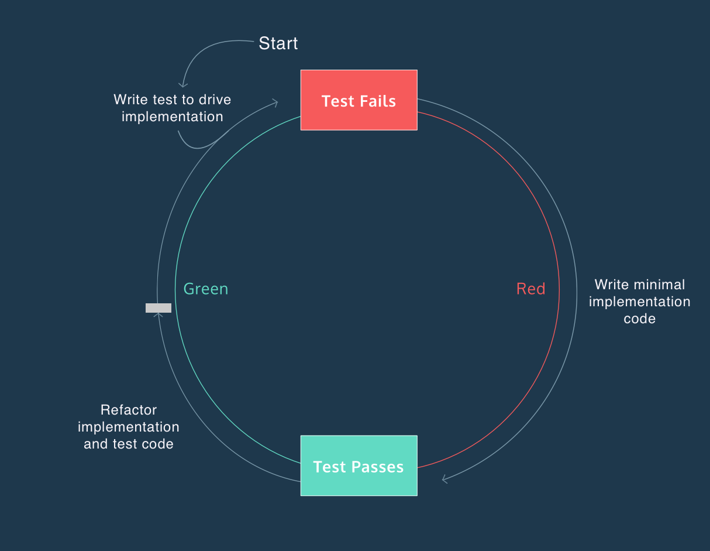
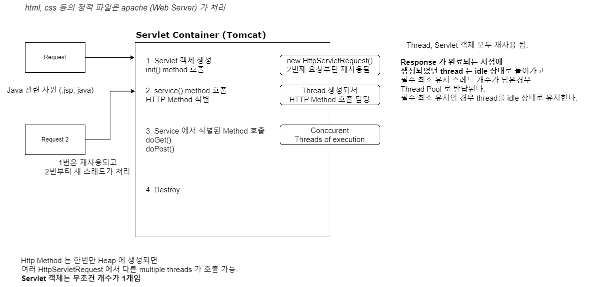
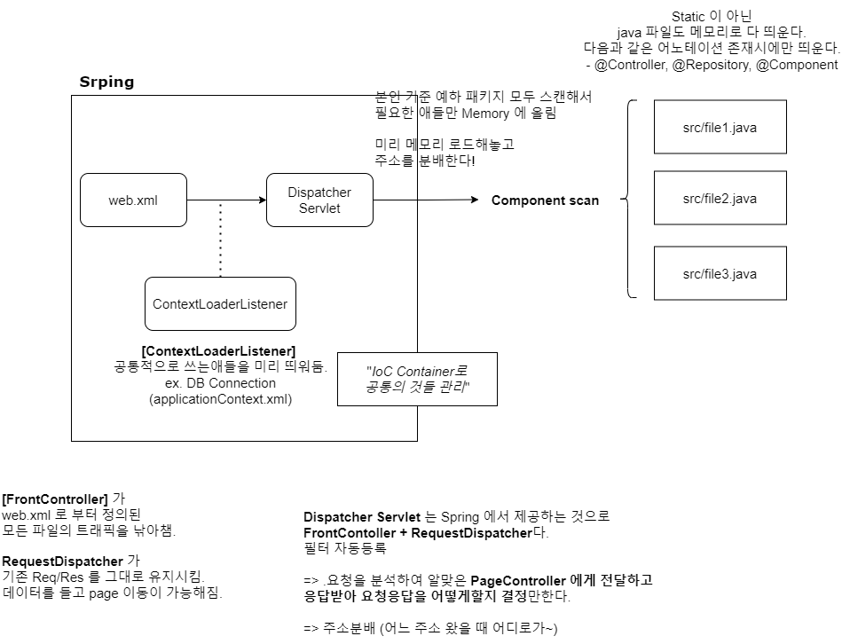
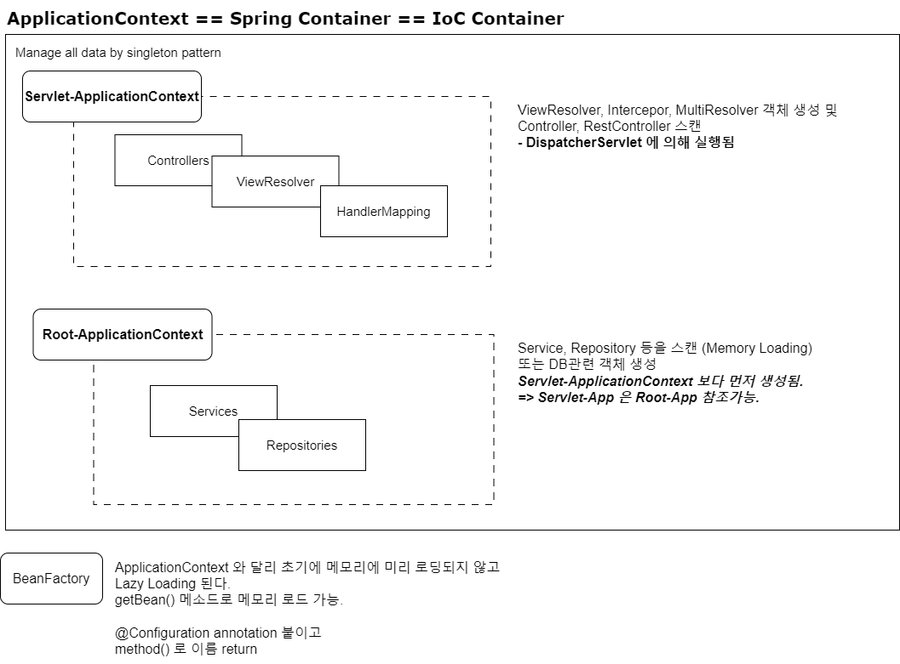

# Test Tips
### 1. 경계값을 테스트하라.
ex) 이상, 초과, 이하, 미만 등.

### 2. 테스트 하기 어려운 영역을 구분하라.
Test 하기 어려운 영역은 크게 2가지다.
1. 난수, 현재 시간, 사용자 입력 등 - Input 의존
2. DB 상태, 이메일 API 등 - Output 의존

> 테스트 용이하기 위한 코드로 변경하기 위해 
> 해당 영역을 **외부로 분리**해야한다.

### 3. RED - GREEN - Refactor


### Why first test?
- 엣지 케이스를 놓치지 않을 수 있게 된다. \
선 구현 방식은 테스트 케이스를 작성할 때 이미 편협한 상태가 된다. (인간의 사고상)
- 빠른 피드백으로 코드 변경이 용이해진다.
- 애초에 이해하기 쉽고 간단한 테스트 케이스를 작성하게된다. \
=> Maintainable code
- 테스트를 먼저 썼기 때문에 , 구현부에서도 테스트 가능한 코드를 쓰게된다. (관점의 변화)
```java
@Getter
public class CafeKiosk {
    private static final LocalTime SHOP_OPEN_TIME = LocalTime.of(7, 0);
    private static final LocalTime SHOP_CLOSE_TIME = LocalTime.of(18, 0);

    /*
    * 테스트 어려운 코드
    * 랜덤값, 현재 시간 값 등 Input 의 예측 불가능성
    */
    public Order createOrder() {
        LocalDateTime currentDateTime = LocalDateTime.now();
        LocalTime currentTime = currentDateTime.toLocalTime();
        if (currentTime.isBefore(SHOP_OPEN_TIME) || currentTime.isAfter(SHOP_CLOSE_TIME)) {
            throw new IllegalArgumentException("You cannot place an order between 07:00 and 18:00");
        }
        return new Order(LocalDateTime.now(), beverages);
    }

    /*
    * 테스트 용이한 코드
    * Input 의 의존성을 외부로 분리하여 예측 가능성.
    */
    public Order createOrder(LocalDateTime currentDateTime) {
        LocalTime currentTime = currentDateTime.toLocalTime();
        if (currentTime.isBefore(SHOP_OPEN_TIME) || currentTime.isAfter(SHOP_CLOSE_TIME)) {
            throw new IllegalArgumentException("You cannot place an order between 07:00 and 18:00");
        }
        return new Order(LocalDateTime.now(), beverages);
    }
}
```

### DisplayName 은 동사로 써라.
명사 나열 보다는 동사형 문장이 더 쉽게 이해된다. \
테스트는 곧 문서가 된다.
#### AS-IS
```java
// 명사형
@Test
@DisplayName("success - 아메리카노 2잔 추가 테스트")
void addSeveralBeverages() {
    var cafeKiosk = new CafeKiosk();
    cafeKiosk.add(new Americano(), 2);
    assertThat(cafeKiosk.getBeverages()).hasSize(2);
}
```
#### TO-BE
```java
@Test
@DisplayName("success - 아메리카노 2잔 추가시 2잔이 주문 목록에 담긴다.")
void addSeveralBeverages() {
    var cafeKiosk = new CafeKiosk();
    cafeKiosk.add(new Americano(), 2);
    assertThat(cafeKiosk.getBeverages()).hasSize(2);
}
```
> 메소드 관점보다 **도메인 용어**를 써라
> 
#### AS-IS
특정 시간 이전 주문 실패
#### TO-BE
카페 영업 시간 이전 주문 불가

실패와 성공 같은 **테스트 현상**을 설명할 필요가 없다.
**도메인 관점에서 작성하라.**

## BDD
Behavior Driven Development
- 함수 단위 테스트보다 시나리오 기반 TC에 집중.
- 개발자가 아닌 사람이 봐도 이해할 수 있을 정도의 추상화 필요.

#### How to?
- Given - When - Then == Arrange - Act - Assert

## CQRS
**커맨드용 서비스(Create Update Delete)와 쿼리(Read) 서비스를 분리하는 설계**

#### When to use?
Single Point of Failure 문제 해결

#### Why to use?
> 장애 격리

CQRS 없이 통합서비스 사용시 커맨드 장애가 쿼리 장애로 이어지고 읽기 장애도 마찬가지로 커맨드 서비스 장애로 이어진다.
대부분의 DB는 Write Only (Master) 와 Read Only (Slave)로 Endpoint 를 나눠서 접근할 수 있는데
CQRS 는 DB와 서비스를 분리시킬 수 있는 장점이 있다.

#### How to use
DB Endpoint 를 분리하여 서비스에 할당한다.

(1) 통합 서비스 사용시 `@Transactional(readOnly = true)` 클래스에 설정
Spring + Layered Architecture 프로젝트에선 Service 최상단에 @Transactional(readOnly = true) 를 설정해놓고
Command 가 필요한 메소드에만 `@Transactional` 어노테이션을 붙이는 방식을 채택한다.

```java
@Service
@Transactional(readOnly = true)
public class ProductService {
  // Query
  public List<ProductResponse> getSellingProducts() {}

  // Command
  @Transactional
  public ProductResponse createProduct(ProductCreateRequest request) {}
}
```
(2) 커맨드 서비스 / 쿼리형 서비스 분리
커맨드 서비스에는 `@Transactional`, 쿼리형(읽기) 서비스에는 `@Transactional(readOnly = true)` 를 붙인다. 

```java
@Service
public class ProductCommandService {
  // Command
  public ProductResponse createProduct(ProductCreateRequest request) {}
}
```

```java
@Service
public class ProductQueryService {
  // Query
  public List<ProductResponse> getSellingProducts() {}
}
```

# Spring Container
## Tomcat Servlet Container


## Spring initialize flow


## DispatcherServlet in Spring

